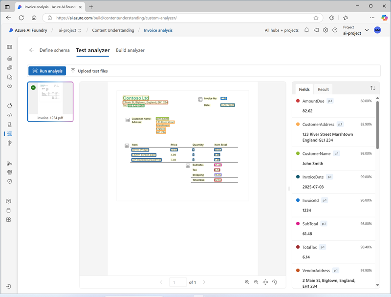

---
lab:
  title: Extrahieren von Informationen aus multimodalen Inhalten
  description: 'Verwenden Sie Verständnis von Azure AI-Inhalten, um Erkenntnisse aus Dokumenten, Bildern, Audioaufzeichnungen und Videos zu gewinnen.'
---

# Extrahieren von Informationen aus multimodalen Inhalten

In dieser Übung verwenden Sie Verständnis von Azure AI-Inhalten, um Informationen aus einer Vielzahl von Inhaltstypen zu extrahieren. einschließlich einer Rechnung, eines Bilds einer Folie mit Diagrammen, einer Audioaufzeichnung mit Sprachnachrichten und einer Videoaufzeichnung einer Telefonkonferenz.

Diese Übung dauert ca. **40** Minuten.

## Erstellen eines Azure AI Foundry-Hubs und -Projekts

Die Funktionen von Azure KI-Foundry, die wir in dieser Übung verwenden werden, erfordern ein Projekt, das auf einer Azure KI-Foundry-*Hub*-Ressource basiert.

1. Öffnen Sie in einem Webbrowser unter `https://ai.azure.com` das [Azure KI Foundry-Portal](https://ai.azure.com) und melden Sie sich mit Ihren Azure-Anmeldeinformationen an. Schließen Sie alle Tipps oder Schnellstartfenster, die bei der ersten Anmeldung geöffnet werden, und verwenden Sie gegebenenfalls das Logo **Azure AI Foundry** oben links, um zur Startseite zu navigieren, die ähnlich wie die folgende Abbildung aussieht (schließen Sie das **Hilfe**-Fenster, falls es geöffnet ist):

    

1. Navigieren Sie im Browser zu `https://ai.azure.com/managementCenter/allResources`, und wählen Sie **Neu erstellen** aus. Wählen Sie dann die Option zum Erstellen einer neuen **KI-Hubressource** aus.
1. Geben Sie im Assistenten zum **Erstellen eines Projekts** einen gültigen Namen für Ihr Projekt ein und wählen Sie die Option zum Erstellen eines neuen Hubs aus. Verwenden Sie anschließend den Link **Hub umbenennen**, um einen gültigen Namen für Ihren neuen Hub anzugeben, erweitern Sie **Erweiterte Optionen** und legen Sie die folgenden Einstellungen für Ihr Projekt fest:
    - **Abonnement:** *Geben Sie Ihr Azure-Abonnement an.*
    - **Ressourcengruppe**: *Erstellen Sie eine Ressourcengruppe, oder wählen Sie eine Ressourcengruppe aus*.
    - **Region:**  Wählen Sie einen der folgenden Standorte aus (*aktuell ist Verständnis von Azure AI-Inhalten nur in diesen Regionen verfügbar*):
        - Australien (Osten)
        - Schweden, Mitte
        - USA (Westen)

    > **Hinweis**: Wenn Sie in einem Azure-Abonnement arbeiten, in dem Richtlinien zur Einschränkung zulässiger Ressourcennamen verwendet werden, müssen Sie möglicherweise den Link unten im Dialogfeld **Neues Projekt erstellen** verwenden, um den Hub über das Azure-Portal zu erstellen.

    > **Hinweis**: Wenn die Schaltfläche **Erstellen** weiterhin deaktiviert ist, benennen Sie Ihren Hub bitte in einen eindeutigen alphanumerischen Wert um.

1. Warten Sie, bis Ihr Projekt erstellt wurde.

## -Inhalt herunterladen

Der Inhalt, den Sie analysieren möchten, befindet sich in einem ZIP-Archiv. Laden Sie ihn herunter, und extrahieren Sie ihn in einem lokalen Ordner.

1. Laden Sie auf einer neuen Browserregisterkarte die Datei [content.zip](https://github.com/microsoftlearning/mslearn-ai-information-extraction/raw/main/Labfiles/content/content.zip) von `https://github.com/microsoftlearning/mslearn-ai-information-extraction/raw/main/Labfiles/content/content.zip` herunter, und speichern Sie sie in einem lokalen Ordner.
1. Extrahieren Sie die heruntergeladene Datei *content.zip*, und zeigen Sie die darin enthaltenen Dateien an. Sie verwenden diese Dateien, um verschiedene Content Understanding-Analysetools in dieser Übung zu erstellen.

> **Hinweis:** Wenn Sie nur die Analyse einer bestimmten Modalität (Dokumente, Bilder, Video oder Audio) untersuchen möchten, können Sie direkt mit der entsprechenden Aufgabe weiter unten fortfahren. Idealerweise gehen Sie die einzelnen Aufgaben durch, um zu lernen, wie Sie Informationen aus verschiedenen Inhaltstypen extrahieren.

## Extrahieren von Informationen aus Rechnungsdokumenten

Sie erstellen eine Analyse mit Verständnis von Azure AI-Inhalten, die Informationen aus Rechnungen extrahieren kann. Sie beginnen mit der Definition eines Schemas auf der Grundlage einer Beispielrechnung.

### Definieren eines Schemas für die Rechnungsanalyse

1. Wählen Sie in der Browserregisterkarte mit der Startseite Ihres Azure AI Foundry-Projekts im Navigationsbereich auf der linken Seite **Inhaltsverständnis** aus.
1. Wählen Sie auf der Seite **Inhaltsverständnis** oben die Registerkarte **Benutzerdefinierte Aufgabe** aus.
1. Wählen Sie auf der Seite „Benutzerdefinierte Aufgabe für Inhaltsverständnis“ die Option **+ Erstellen** aus, und erstellen Sie eine Aufgabe mit den folgenden Einstellungen:
    - **Aufgabenname**: `Invoice analysis`
    - **Beschreibung:** `Extract data from an invoice`
    - **Inhaltsanalyse für einzelne Datei**: *Ausgewählt*
    - **Erweiterte Einstellungen**:
        - **Azure KI Services-Verbindung**: *Die Azure KI Services-Ressource in Ihrem Azure AI Foundry-Hub*
        - **Azure Blob Storage-Konto**: *Das Standardspeicherkonto in Ihrem Azure AI Foundry-Hub*
1. Bitte warten Sie, bis die Vorgang erstellt wurde.

    > **Tipp**: Wenn beim Zugriff auf den Speicher ein Fehler auftritt, warten Sie bitte eine Minute und versuchen Sie es erneut. Die Erteilung von Berechtigungen für einen neuen Hub kann einige Minuten dauern.

1. Laden Sie auf der Seite **Schema definieren** die Datei **invoice-1234.pdf** aus dem Ordner hoch, in den Sie Inhaltsdateien extrahiert haben. Diese Datei enthält die folgende Rechnung:

    

1. Wählen Sie auf der Seite **Schema definieren** nach dem Hochladen der Rechnungsdatei die Vorlage für die **Rechnungsdatenextraktion** und dann **Erstellen** aus.

    Die Vorlage *Rechnungsanalyse* enthält Felder, die üblicherweise in Rechnungen zu finden sind. Mit dem Schema-Editor können Sie alle vorgeschlagenen Felder, die Sie nicht benötigen, löschen und beliebige benutzerdefinierte Felder hinzufügen.

1. Wählen Sie in der Liste der vorgeschlagenen Felder **BillingAddress** aus. Dieses Feld wird für das von Ihnen hochgeladene Rechnungsformat nicht benötigt. Verwenden Sie daher das Symbol **Feld löschen** (**&#128465;**) neben dem ausgewählten Feld, um es zu löschen.
1. Löschen Sie nun die folgenden vorgeschlagenen Felder, die für Ihr Rechnungsschema nicht benötigt werden:
    - BillingAddressRecipient
    - CustomerAddressRecipient
    - CustomerId
    - CustomerTaxId
    - DueDate
    - InvoiceTotal
    - PaymentTerm
    - PreviousUnpaidBalance
    - PurchaseOrder
    - RemittanceAddress
    - RemittanceAddressRecipient
    - ServiceAddress
    - ServiceAddressRecipient
    - ShippingAddress
    - ShippingAddressRecipient
    - TotalDiscount
    - VendorAddressRecipient
    - VendorTaxId
    - TaxDetails
1. Verwenden Sie die Schaltfläche **+ Neues Feld hinzufügen**, um die folgenden Felder hinzuzufügen, und wählen Sie für jedes neue Feld **Änderungen speichern** (**&#10003;**) aus:

    | Feldname | Feldbeschreibung | Werttyp | Methode |
    |--|--|--|--|
    | `VendorPhone` | `Vendor telephone number` | String | Extrahieren |
    | `ShippingFee` | `Fee for shipping` | Anzahl | Extrahieren |

1. Beachten Sie in der Zeile für das Feld **Elemente**, dass es sich bei diesem Feld um eine *Tabelle* handelt (enthält die Sammlung von Elementen in der Rechnung). Wählen Sie das Symbol zum **Bearbeiten** (&#9638;) aus, um eine neue Seite mit ihren Unterfeldern zu öffnen.
1. Entfernen Sie die folgenden Unterfelder aus der Tabelle **Elemente**:
    - Datum
    - ProductCode
    - Einheit
    - TaxAmount
    - TaxRate
1. Verwenden Sie die Schaltfläche **OK**, um die Änderungen zu bestätigen und zur obersten Ebene des Rechnungsschemas zurückzukehren.

1. Überprüfen Sie, ob Ihr abgeschlossenes Schema wie folgt aussieht, und wählen Sie **Speichern** aus.

    

1. Falls die Analyse nicht automatisch beginnt, wählen Sie auf der Seite **Analysetool testen** den Befehl **Analyse ausführen** aus. Warten Sie anschließend, bis die Analyse abgeschlossen ist.

1. Überprüfen Sie die Analyseergebnisse, die in etwa wie folgt aussehen sollten:

    

1. Zeigen Sie die Details der Felder an, die im Bereich **Felder** ermittelt wurden.

### Erstellen und Testen eines Analysetools für Rechnungen

Nachdem Sie ein Modell zum Extrahieren von Feldern aus Rechnungen trainiert haben, können Sie ein Analysetool erstellen, das mit ähnlichen Dokumenten verwendet werden kann.

1. Wählen Sie die Seite **Liste der Analysetools** aus, wählen Sie **+ Analysetool erstellen** aus, und erstellen Sie ein neues Analysetool mit den folgenden Eigenschaften (genau wie hier angegeben):
    - **Name**: `invoice-analyzer`
    - **Beschreibung:** `Invoice analyzer`
1. Warten Sie, bis das neue Analysetool bereit ist (Sie können dies mit der Schaltfläche **Aktualisieren** überprüfen).
1. Wenn das Analysetool erstellt wurde, wählen Sie den Link **Rechnungsanalyse** aus. Die im Schema des Analysetools definierten Felder werden angezeigt.
1. Wählen Sie auf der Seite **Rechnungsanalyse** die Registerkarte **Test** aus.
1. Verwenden Sie die Schaltfläche **+ Testdateien hochladen**, um **invoice-1235.pdf** aus dem Ordner hochzuladen, in den Sie die Inhaltsdateien extrahiert haben, und klicken Sie auf **Analyse ausführen**, um Felddaten aus der Rechnung zu extrahieren.

    Die zu analysierende Rechnung sieht wie folgt aus:

    

1. Überprüfen Sie im Bereich **Felder**, ob das Analysegerät die richtigen Felder aus der Testrechnung extrahiert hat.
1. Überprüfen Sie den Bereich **Ergebnisse**, um die JSON-Antwort anzuzeigen, die das Analysetool an eine Clientanwendung zurückgibt.
1. Zeigen Sie auf der Registerkarte **Codebeispiel** den Beispielcode an, mit dem Sie eine Clientanwendung entwickeln können, die die REST-Schnittstelle für Inhaltsverständnis verwendet, um Ihr Analysetool aufzurufen.
1. Schließen Sie die Seite **Rechnungsanalyse**.

## Extrahieren von Informationen aus einem Folienbild

Sie erstellen eine Analyse mit Verständnis von Azure AI-Inhalten, die Informationen aus einer Folie mit Diagrammen extrahieren kann.

### Definieren eines Schemas für die Bildanalyse

1. Wählen Sie in der Browserregisterkarte mit der Startseite Ihres Azure AI Foundry-Projekts im Navigationsbereich auf der linken Seite **Inhaltsverständnis** aus.
1. Wählen Sie auf der Seite **Inhaltsverständnis** oben die Registerkarte **Benutzerdefinierte Aufgabe** aus.
1. Wählen Sie auf der Seite „Benutzerdefinierte Aufgabe für Inhaltsverständnis“ die Option **+ Erstellen** aus, und erstellen Sie eine Aufgabe mit den folgenden Einstellungen:
    - **Aufgabenname**: `Slide analysis`
    - **Beschreibung:** `Extract data from an image of a slide`
    - **Inhaltsanalyse für einzelne Datei**: *Ausgewählt*
    - **Erweiterte Einstellungen**:
        - **Azure KI Services-Verbindung**: *Die Azure KI Services-Ressource in Ihrem Azure AI Foundry-Hub*
        - **Azure Blob Storage-Konto**: *Das Standardspeicherkonto in Ihrem Azure AI Foundry-Hub*
1. Bitte warten Sie, bis die Vorgang erstellt wurde.

    > **Tipp**: Wenn beim Zugriff auf den Speicher ein Fehler auftritt, warten Sie bitte eine Minute und versuchen Sie es erneut. Die Erteilung von Berechtigungen für einen neuen Hub kann einige Minuten dauern.

1. Laden Sie auf der Seite **Schema definieren** die Datei **slide-1.jpg** aus dem Ordner hoch, in den Sie Inhaltsdateien extrahiert haben. Wählen Sie dann die Vorlage **Bildanalyse** und **Erstellen** aus.

    Die Vorlage *Bildanalyse* enthält keine vordefinierten Felder. Sie müssen Felder definieren, um die Informationen zu beschreiben, die Sie extrahieren möchten.

1. Verwenden Sie die Schaltfläche **+ Neues Feld hinzufügen**, um die folgenden Felder hinzuzufügen, und wählen Sie für jedes neue Feld **Änderungen speichern** (**&#10003;**) aus:

    | Feldname | Feldbeschreibung | Werttyp | Methode |
    |--|--|--|--|
    | `Title` | `Slide title` | String | Generate |
    | `Summary` | `Summary of the slide` | String | Generate |
    | `Charts` | `Number of charts on the slide` | Ganzzahl | Generate |

1. Verwenden Sie die Schaltfläche **+ Neues Feld hinzufügen**, um ein neues Feld namens `QuarterlyRevenue` mit der Beschreibung `Revenue per quarter` und dem Werttyp **Tabelle** hinzuzufügen, und speichern Sie das neue Feld (**&#10003;**). Fügen Sie dann auf der neuen Seite für die geöffneten Tabellenunterfelder die folgenden Unterfelder hinzu:

    | Feldname | Feldbeschreibung | Werttyp | Methode |
    |--|--|--|--|
    | `Quarter` | `Which quarter?` | String | Generate |
    | `Revenue` | `Revenue for the quarter` | Anzahl | Generate |

1. Wählen Sie **Zurück** (das Pfeilsymbol in der Nähe der Schaltfläche **Neues Unterfeld hinzufügen**) oder **&#10003; OK** aus, um zur obersten Ebene Ihres Schemas zurückzukehren, und verwenden Sie die Schaltfläche **+ Neue Felder hinzufügen**, um ein neues Feld mit dem Namen `ProductCategories`, der Beschreibung `Product categories` und dem Werttyp **Tabelle** hinzuzufügen, und speichern Sie das neue Feld (**&#10003;**). Fügen Sie dann auf der neuen Seite für die geöffneten Tabellenunterfelder die folgenden Unterfelder hinzu:

    | Feldname | Feldbeschreibung | Werttyp | Methode |
    |--|--|--|--|
    | `ProductCategory` | `Product category name` | String | Generate |
    | `RevenuePercentage` | `Percentage of revenue` | Anzahl | Generate |

1. Wählen Sie **Zurück** (das Pfeilsymbol in der Nähe der Schaltfläche **Neues Unterfeld hinzufügen**) oder **&#10003; OK** aus, um zur obersten Ebene Ihres Schemas zurückzukehren und zu überprüfen, ob es wie folgt aussieht. Klicken Sie dann auf **Speichern**.

    

1. Falls die Analyse nicht automatisch beginnt, wählen Sie auf der Seite **Analysetool testen** den Befehl **Analyse ausführen** aus. Warten Sie anschließend, bis die Analyse abgeschlossen ist.

    Die zu analysierende Folie sieht wie folgt aus:

    

1. Überprüfen Sie die Analyseergebnisse, die in etwa wie folgt aussehen sollten:

    

1. Zeigen Sie die Details der Felder an, die im Bereich **Felder** identifiziert wurden, und erweitern Sie die Felder **QuarterlyRevenue** und **ProductCategories**, um die Werte der Unterfelder anzuzeigen.

### Erstellen und Testen eines Analysetools

Nachdem Sie ein Modell zum Extrahieren von Feldern aus Folien trainiert haben, können Sie ein Analysetool erstellen, das mit ähnlichen Folienbildern verwendet werden kann.

1. Wählen Sie die Seite **Liste der Analysetools** aus, wählen Sie **+ Analysetool erstellen** aus, und erstellen Sie ein neues Analysetool mit den folgenden Eigenschaften (genau wie hier angegeben):
    - **Name**: `slide-analyzer`
    - **Beschreibung:** `Slide image analyzer`
1. Warten Sie, bis das neue Analysetool bereit ist (Sie können dies mit der Schaltfläche **Aktualisieren** überprüfen).
1. Wenn das Analysetool erstellt wurde, wählen Sie den Link **Folienanalyse** aus. Die im Schema des Analysetools definierten Felder werden angezeigt.
1. Wählen Sie auf der Seite **Folienanalyse** die Registerkarte **Test** aus.
1. Verwenden Sie die Schaltfläche **+ Testdateien hochladen**, um **slide-2.jpg** aus dem Ordner hochzuladen, in den Sie die Inhaltsdateien extrahiert haben, und klicken Sie auf **Analyse ausführen**, um Felddaten aus dem Bild zu extrahieren.

    Die zu analysierende Folie sieht wie folgt aus:

    

1. Überprüfen Sie im Bereich **Felder**, ob das Analysegerät die richtigen Felder aus dem Folienbild extrahiert hat.

    > **Hinweis:** Folie 2 enthält keine Aufschlüsselung nach Produktkategorie, sodass die Umsatzdaten der Produktkategorie nicht gefunden werden.

1. Überprüfen Sie den Bereich **Ergebnisse**, um die JSON-Antwort anzuzeigen, die das Analysetool an eine Clientanwendung zurückgibt.
1. Zeigen Sie auf der Registerkarte **Codebeispiel** den Beispielcode an, mit dem Sie eine Clientanwendung entwickeln können, die die REST-Schnittstelle für Inhaltsverständnis verwendet, um Ihr Analysetool aufzurufen.
1. Schließen Sie die Seite **Folienanalyse**.

## Extrahieren von Informationen aus einer Voicemail-Audioaufzeichnung

Sie erstellen eine Analyse mit Verständnis von Azure AI-Inhalten, die Informationen aus einer Audioaufzeichnung einer Voicemailnachricht extrahieren kann.

### Definieren eines Schemas für die Audioanalyse

1. Wählen Sie in der Browserregisterkarte mit der Startseite Ihres Azure AI Foundry-Projekts im Navigationsbereich auf der linken Seite **Inhaltsverständnis** aus.
1. Wählen Sie auf der Seite **Inhaltsverständnis** oben die Registerkarte **Benutzerdefinierte Aufgabe** aus.
1. Wählen Sie auf der Seite „Benutzerdefinierte Aufgabe für Inhaltsverständnis“ die Option **+ Erstellen** aus, und erstellen Sie eine Aufgabe mit den folgenden Einstellungen:
    - **Aufgabenname**: `Voicemail analysis`
    - **Beschreibung:** `Extract data from a voicemail recording`
    - **Inhaltsanalyse für einzelne Datei**: *Ausgewählt*
    - **Erweiterte Einstellungen**:
        - **Azure KI Services-Verbindung**: *Die Azure KI Services-Ressource in Ihrem Azure AI Foundry-Hub*
        - **Azure Blob Storage-Konto**: *Das Standardspeicherkonto in Ihrem Azure AI Foundry-Hub*
1. Bitte warten Sie, bis die Vorgang erstellt wurde.

    > **Tipp**: Wenn beim Zugriff auf den Speicher ein Fehler auftritt, warten Sie bitte eine Minute und versuchen Sie es erneut. Die Erteilung von Berechtigungen für einen neuen Hub kann einige Minuten dauern.

1. Laden Sie auf der Seite **Schema definieren** die Datei **call-1.mp3** aus dem Ordner hoch, in den Sie Inhaltsdateien extrahiert haben. Wählen Sie dann die Vorlage **Speech-Transkriptanalyse** und dann **Erstellen** aus.
1. Wählen Sie im Bereich **Inhalt** auf der rechten Seite **Transkriptionsvorschau abrufen** aus, um eine Transkription der aufgezeichneten Nachricht anzuzeigen.

    Die Vorlage *Speech-Transkriptanalyse* enthält keine vordefinierten Felder. Sie müssen Felder definieren, um die Informationen zu beschreiben, die Sie extrahieren möchten.

1. Verwenden Sie die Schaltfläche **+ Neues Feld hinzufügen**, um die folgenden Felder hinzuzufügen, und wählen Sie für jedes neue Feld **Änderungen speichern** (**&#10003;**) aus:

    | Feldname | Feldbeschreibung | Werttyp | Methode |
    |--|--|--|--|
    | `Caller` | `Person who left the message` | String | Generate |
    | `Summary` | `Summary of the message` | String | Generate |
    | `Actions` | `Requested actions` | String | Generate |
    | `CallbackNumber` | `Telephone number to return the call` | String | Generate |
    | `AlternativeContacts` | `Alternative contact details` | Liste der Zeichenfolgen | Generate |

1. Überprüfen Sie, ob Ihr Schema wie folgt aussieht. Klicken Sie dann auf **Speichern**.

    

1. Falls die Analyse nicht automatisch beginnt, wählen Sie auf der Seite **Analysetool testen** den Befehl **Analyse ausführen** aus. Warten Sie anschließend, bis die Analyse abgeschlossen ist.

    Die Audioanalyse kann einige Zeit in Anspruch nehmen. Während Sie warten, können Sie die Audiodatei unten wiedergeben:

    <video controls src="https://github.com/MicrosoftLearning/mslearn-ai-information-extraction/raw/refs/heads/main/Instructions/Labs/media/call-1.mp4" title="Aufruf 1" width="300">
        <track src="https://github.com/MicrosoftLearning/mslearn-ai-information-extraction/raw/refs/heads/main/Instructions/Labs/media/call-1.vtt" kind="captions" srclang="en" label="English">
    </video>

    **Hinweis:** Diese Audiodatei wurde mithilfe von KI generiert.

1. Überprüfen Sie die Analyseergebnisse, die in etwa wie folgt aussehen sollten:

    

1. Zeigen Sie die Details der Felder an, die im Bereich **Felder** ermittelt wurden, und erweitern Sie das Feld **AlternativeContacts**, um die aufgeführten Werte anzuzeigen.

### Erstellen und Testen eines Analysetools

Nachdem Sie ein Modell zum Extrahieren von Feldern aus Sprachnachrichten trainiert haben, können Sie ein Analysetool erstellen, das mit ähnlichen Audioaufzeichnungen verwendet werden kann.

1. Wählen Sie die Seite **Liste der Analysetools** aus, wählen Sie **+ Analysetool erstellen** aus, und erstellen Sie ein neues Analysetool mit den folgenden Eigenschaften (genau wie hier angegeben):
    - **Name**: `voicemail-analyzer`
    - **Beschreibung:** `Voicemail audio analyzer`
1. Warten Sie, bis das neue Analysetool bereit ist (Sie können dies mit der Schaltfläche **Aktualisieren** überprüfen).
1. Wenn das Analysetool erstellt wurde, wählen Sie den Link **Voicemailanalyse** aus. Die im Schema des Analysetools definierten Felder werden angezeigt.
1. Wählen Sie auf der Seite **Voicemailanalyse** die Registerkarte **Test** aus.
1. Verwenden Sie die Schaltfläche **+ Testdateien hochladen**, um **call-2.mp3** aus dem Ordner hochzuladen, in den Sie die Inhaltsdateien extrahiert haben, und klicken Sie auf **Analyse ausführen**, um Felddaten aus der Audiodatei zu extrahieren.

    Die Audioanalyse kann einige Zeit in Anspruch nehmen. Während Sie warten, können Sie die Audiodatei unten wiedergeben:

    <video controls src="https://github.com/MicrosoftLearning/mslearn-ai-information-extraction/raw/refs/heads/main/Instructions/Labs/media/call-2.mp4" title="Anruf 2" width="300">
        <track src="https://github.com/MicrosoftLearning/mslearn-ai-information-extraction/raw/refs/heads/main/Instructions/Labs/media/call-2.vtt" kind="captions" srclang="en" label="English">
    </video>

    **Hinweis:** Diese Audiodatei wurde mithilfe von KI generiert.

1. Überprüfen Sie im Bereich **Felder**, ob das Analysegerät die richtigen Felder aus der Sprachnachricht extrahiert hat.
1. Überprüfen Sie den Bereich **Ergebnisse**, um die JSON-Antwort anzuzeigen, die das Analysetool an eine Clientanwendung zurückgibt.
1. Zeigen Sie auf der Registerkarte **Codebeispiel** den Beispielcode an, mit dem Sie eine Clientanwendung entwickeln können, die die REST-Schnittstelle für Inhaltsverständnis verwendet, um Ihr Analysetool aufzurufen.
1. Schließen Sie die Seite **Voicemailanalyse**.

## Extrahieren von Informationen aus einer Videokonferenzaufzeichnung

Sie erstellen eine Analyse mit Verständnis von Azure AI-Inhalten, die Informationen aus einer Videoaufzeichnung einer Konferenz extrahieren kann.

### Definieren eines Schemas für die Videoanalyse

1. Wählen Sie in der Browserregisterkarte mit der Startseite Ihres Azure AI Foundry-Projekts im Navigationsbereich auf der linken Seite **Inhaltsverständnis** aus.
1. Wählen Sie auf der Seite **Inhaltsverständnis** oben die Registerkarte **Benutzerdefinierte Aufgabe** aus.
1. Wählen Sie auf der Seite „Benutzerdefinierte Aufgabe für Inhaltsverständnis“ die Option **+ Erstellen** aus, und erstellen Sie eine Aufgabe mit den folgenden Einstellungen:
    - **Aufgabenname**: `Conference call video analysis`
    - **Beschreibung:** `Extract data from a video conference recording`
    - **Inhaltsanalyse für einzelne Datei**: *Ausgewählt*
    - **Erweiterte Einstellungen**:
        - **Azure KI Services-Verbindung**: *Die Azure KI Services-Ressource in Ihrem Azure AI Foundry-Hub*
        - **Azure Blob Storage-Konto**: *Das Standardspeicherkonto in Ihrem Azure AI Foundry-Hub*
1. Bitte warten Sie, bis die Vorgang erstellt wurde.

    > **Tipp**: Wenn beim Zugriff auf den Speicher ein Fehler auftritt, warten Sie bitte eine Minute und versuchen Sie es erneut. Die Erteilung von Berechtigungen für einen neuen Hub kann einige Minuten dauern.

1. Laden Sie auf der Seite **Schema definieren** die Datei **meeting-1.mp4** aus dem Ordner hoch, in den Sie Inhaltsdateien extrahiert haben. Wählen Sie dann die Vorlage **Videoanalyse** und **Erstellen** aus.
1. Wählen Sie im Bereich **Inhalt** auf der rechten Seite **Transkriptionsvorschau abrufen** aus, um eine Transkription der aufgezeichneten Nachricht anzuzeigen.

    Die Vorlage *Videoanalyse* extrahiert Daten für das Video. Sie enthält keine vordefinierten Felder. Sie müssen Felder definieren, um die Informationen zu beschreiben, die Sie extrahieren möchten.

1. Verwenden Sie die Schaltfläche **+ Neues Feld hinzufügen**, um die folgenden Felder hinzuzufügen, und wählen Sie für jedes neue Feld **Änderungen speichern** (**&#10003;**) aus:

    | Feldname | Feldbeschreibung | Werttyp | Methode |
    |--|--|--|--|
    | `Summary` | `Summary of the discussion` | String | Generate |
    | `Participants` | `Count of meeting participants` | Ganzzahl | Generate |
    | `ParticipantNames` | `Names of meeting participants` | Liste der Zeichenfolgen | Generate |
    | `SharedSlides` | `Descriptions of any PowerPoint slides presented` | Liste der Zeichenfolgen | Generate |
    | `AssignedActions` | `Tasks assigned to participants` | Tabelle |  |

1. Wenn Sie das Feld **AssignedActions** eingeben, erstellen Sie in der angezeigten Unterfeldtabelle die folgenden Unterfelder:

    | Feldname | Feldbeschreibung | Werttyp | Methode |
    |--|--|--|--|
    | `Task` | `Description of the task` | String | Generate |
    | `AssignedTo` | `Who the task is assigned to` | String | Generate |

1. Wählen Sie **Zurück** (das Pfeilsymbol in der Nähe der Schaltfläche **Neues Unterfeld hinzufügen**) oder **&#10003; OK** aus, um zur obersten Ebene Ihres Schemas zurückzukehren und zu überprüfen, ob es wie folgt aussieht. Klicken Sie dann auf **Speichern**.

1. Überprüfen Sie, ob Ihr Schema wie folgt aussieht. Klicken Sie dann auf **Speichern**.

    

1. Falls die Analyse nicht automatisch beginnt, wählen Sie auf der Seite **Analysetool testen** den Befehl **Analyse ausführen** aus. Warten Sie anschließend, bis die Analyse abgeschlossen ist.

    Die Videoanalyse kann einige Zeit in Anspruch nehmen. Während Sie warten, können Sie das folgende Video ansehen:

    <video controls src="https://github.com/MicrosoftLearning/mslearn-ai-information-extraction/raw/refs/heads/main/Instructions/Labs/media/meeting-1.mp4" title="Meeting 1" width="480">
        <track src="https://github.com/MicrosoftLearning/mslearn-ai-information-extraction/raw/refs/heads/main/Instructions/Labs/media/meeting-1.vtt" kind="captions" srclang="en" label="English">
    </video>

    **Hinweis:** Dieses Video wurde mithilfe von KI generiert.

1. Überprüfen Sie nach Abschluss der Analyse die Ergebnisse, die in etwa wie folgt aussehen sollten:

    

1. Zeigen Sie im Bereich **Felder** die extrahierten Daten für das Video an, einschließlich der Felder, die Sie hinzugefügt haben. Zeigen Sie die generierten Feldwerte an, und erweitern Sie die Listen- und Tabellenfelder nach Bedarf.

### Erstellen und Testen eines Analysetools

Nachdem Sie ein Modell zum Extrahieren von Feldern aus Konferenzaufzeichnungen trainiert haben, können Sie ein Analysetool erstellen, das mit ähnlichen Videos verwendet werden kann.

1. Wählen Sie die Seite **Liste der Analysetools** aus, wählen Sie **+ Analysetool erstellen** aus, und erstellen Sie ein neues Analysetool mit den folgenden Eigenschaften (genau wie hier angegeben):
    - **Name**: `conference-call-analyzer`
    - **Beschreibung:** `Conference call video analyzer`
1. Warten Sie, bis das neue Analysetool bereit ist (Sie können dies mit der Schaltfläche **Aktualisieren** überprüfen).
1. Wenn das Analysetool erstellt wurde, wählen Sie den Link **Konferenzanalyse** aus. Die im Schema des Analysetools definierten Felder werden angezeigt.
1. Wählen Sie auf der Seite **Konferenzanalyse** die Registerkarte **Test** aus.
1. Verwenden Sie die Schaltfläche **Testdateien hochladen**, um **meeting-2.mp4** aus dem Ordner hochzuladen, in den Sie die Inhaltsdateien extrahiert haben, und führen Sie die Analyse aus, um Felddaten aus der Audiodatei zu extrahieren.

    Die Videoanalyse kann einige Zeit in Anspruch nehmen. Während Sie warten, können Sie das folgende Video ansehen:

    <video controls src="https://github.com/MicrosoftLearning/mslearn-ai-information-extraction/raw/refs/heads/main/Instructions/Labs/media/meeting-2.mp4" title="Meeting 2" width="480">
        <track src="https://github.com/MicrosoftLearning/mslearn-ai-information-extraction/raw/refs/heads/main/Instructions/Labs/media/meeting-2.vtt" kind="captions" srclang="en" label="English">
    </video>

    **Hinweis:** Dieses Video wurde mithilfe von KI generiert.

1. Überprüfen Sie den Bereich **Felder**, und zeigen Sie die Felder an, die das Analysetool für das Konferenzvideo extrahiert hat.
1. Überprüfen Sie den Bereich **Ergebnisse**, um die JSON-Antwort anzuzeigen, die das Analysetool an eine Clientanwendung zurückgibt.
1. Schließen Sie die Seite **Konferenzanalyse**.

## Bereinigen

Wenn Sie Arbeit mit dem Content Understanding-Service abgeschlossen haben, sollten Sie die in dieser Übung erstellten Ressourcen löschen, um unnötige Azure-Kosten zu vermeiden.

1. Navigieren Sie im Azure AI Foundry-Portal zu Ihrem Hub, wählen Sie auf der Übersichtsseite Ihr Projekt aus, und löschen Sie es.
1. Löschen Sie im Azure-Portal die Ressourcengruppe, die Sie in dieser Übung erstellt haben.
