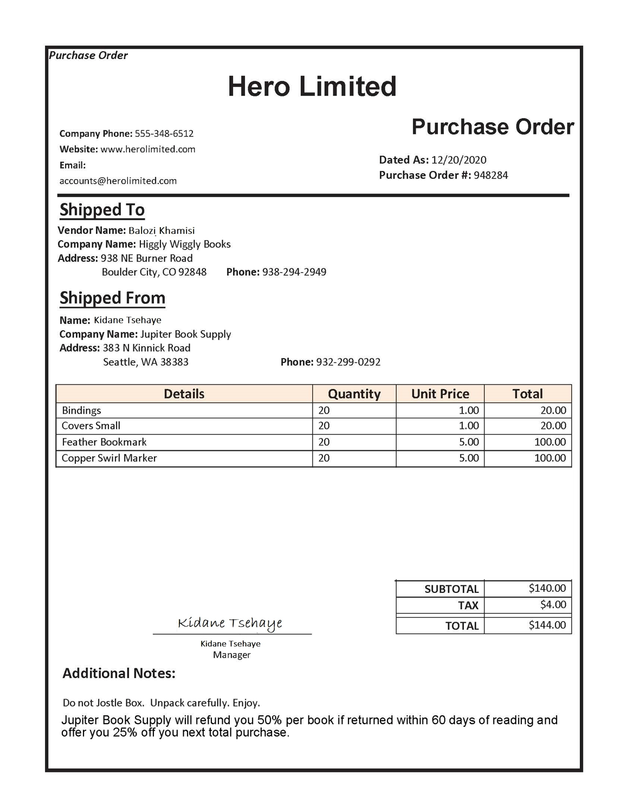

---
lab:
  title: Analysieren von Formularen mit benutzerdefinierten Azure KI Dokument Intelligenz-Modellen
  description: 'Erstellen Sie ein benutzerdefiniertes Dokument Intelligenz-Modell, um bestimmte Daten aus Dokumenten zu extrahieren.'
---

# Analysieren von Formularen mit benutzerdefinierten Azure KI Dokument Intelligenz-Modellen

Angenommen, in einem Unternehmen müssen Mitarbeiter*innen die Daten von Bestellungen manuell in eine Datenbank eingeben. Das Unternehmen möchte KI-Dienste nutzen, um den Dateneingabeprozess zu verbessern. Sie planen, ein Machine Learning-Modell zu erstellen, das das Formular liest und strukturierte Daten erzeugt, die zum automatischen Aktualisieren einer Datenbank verwendet werden können.

**Azure KI Dokument Intelligenz** ist ein Azure KI-Dienst, mit dem Benutzer*innen Software zur automatisierten Datenverarbeitung erstellen können. Diese Software kann Text, Schlüssel-Wert-Paare und Tabellen mithilfe der optischen Zeichenerkennung (Optical Character Recognition, OCR) aus Formulardokumenten extrahieren. Azure KI Dokument Intelligenz verfügt über vordefinierte Modelle zur Erkennung von Rechnungen, Quittungen und Visitenkarten. Der Dienst bietet auch die Funktionalität zum Trainieren von benutzerdefinierten Modellen. In dieser Übung konzentrieren wir uns auf das Erstellen benutzerdefinierter Modelle.

Obwohl diese Übung auf Python basiert, können Sie ähnliche Anwendungen mit mehreren sprachspezifischen SDKs entwickeln, einschließlich:

- [Azure KI Dokument Intelligenz-Clientbibliothek für Python](https://pypi.org/project/azure-ai-formrecognizer/)
- [Azure KI Dokument Intelligenz-Clientbibliothek für Microsoft .NET](https://www.nuget.org/packages/Azure.AI.FormRecognizer)
- [Azure KI Dokument Intelligenz-Clientbibliothek für JavaScript](https://www.npmjs.com/package/@azure/ai-form-recognizer)

Diese Übung dauert ca. **30** Minuten.

## Erstellen einer Ressource für Azure KI Dokument Intelligenz

Um den Dienst „Azure KI Dokument Intelligenz“ zu nutzen, benötigen Sie eine Azure KI Dokument Intelligenz- oder Azure KI Services-Ressource in Ihrem Azure-Abonnement. Über das Azure-Portal erstellen Sie eine Ressource.

1. Öffnen Sie auf einer Browserregisterkarte das Azure-Portal unter `https://portal.azure.com`, und melden Sie sich mit dem Microsoft-Konto an, das Ihrem Azure-Abonnement zugeordnet ist.
1. Navigieren Sie im Azure-Portal auf der Homepage zum oberen Suchfeld, geben Sie **Dokumentintelligenz** ein, und drücken Sie dann die **Eingabetaste**.
1. Wählen Sie auf der Seite **Dokumentintelligenz** die Option **Erstellen** aus.
1. Erstellen Sie auf der Seite **Dokument Intelligenz erstellen** eine neue Ressource mit den folgenden Einstellungen:
    - **Abonnement**: Ihr Azure-Abonnement.
    - **Ressourcengruppe**: Erstellen oder wählen Sie eine Ressourcengruppe aus.
    - **Region:** Eine beliebige verfügbare Region
    - **Name:** Ein gültiger Name für Ihre Dokument Intelligenz-Ressource
    - **Tarif:** Free F0 (*wenn kein Free-Tarif verfügbar ist, wählen Sie* Standard S0 aus)
1. Wählen Sie nach Abschluss der Bereitstellung **Zu Ressource wechseln** aus, um die Seite **Übersicht** der Ressource anzuzeigen.

## Vorbereiten der Entwicklung einer App in Cloud Shell

Sie entwickeln Ihre Textübersetzungs-App mit Cloud Shell. Die Codedateien für Ihre App wurden in einem GitHub-Repository bereitgestellt.

1. Verwenden Sie im Azure-Portal die Schaltfläche **[\>_]** rechts neben der Suchleiste oben auf der Seite, um eine neue Cloud Shell im Azure-Portal zu erstellen, und wählen Sie eine ***PowerShell***-Umgebung aus. Die Cloud Shell bietet eine Befehlszeilenschnittstelle in einem Bereich am unteren Rand des Azure-Portals.

    > **Hinweis**: Wenn Sie zuvor eine Cloud-Shell erstellt haben, die eine *Bash*-Umgebung verwendet, wechseln Sie zu ***PowerShell***.

1. Ändern Sie die Größe des Cloud Shell-Bereichs, damit sowohl die Befehlszeilenkonsole als auch das Azure-Portal angezeigt werden. Sie müssen den Fensterteiler verwenden, um zwischen den beiden Bereichen zu wechseln.

1. Wählen Sie in der Cloud Shell-Symbolleiste im Menü **Einstellungen** das Menüelement **Zur klassischen Version wechseln** aus (dies ist für die Verwendung des Code-Editors erforderlich).

    **<font color="red">Stellen Sie sicher, dass Sie zur klassischen Version der Cloud Shell gewechselt haben, bevor Sie fortfahren.</font>**

1. Geben Sie im PowerShell-Bereich die folgenden Befehle ein, um das GitHub-Repository für diese Übung zu klonen:

    ```
   rm -r mslearn-ai-info -f
   git clone https://github.com/microsoftlearning/mslearn-ai-information-extraction mslearn-ai-info
    ```

    > **Tipp**: Wenn Sie Befehle in die Cloudshell einfügen, kann die Ausgabe einen großen Teil des Bildschirmpuffers einnehmen. Sie können den Bildschirm löschen, indem Sie den Befehl `cls` eingeben, um sich besser auf die einzelnen Aufgaben konzentrieren zu können.

1. Navigieren Sie nach dem Klonen des Repositorys zu dem Ordner, der die Codedateien der Anwendung enthält:  

    ```
   cd mslearn-ai-info/Labfiles/custom-doc-intelligence
    ```

## Sammeln von Dokumenten für das Training

Sie verwenden Beispielformulare wie dieses, um ein Modell zu trainieren: 



1. Führen Sie in der Befehlszeile `ls ./sample-forms` aus, um den Inhalt im Ordner **sample-forms** aufzulisten. Beachten Sie, dass der Ordner Dateien enthält, deren Namen auf **.json** und **.jpg** enden.

    Sie verwenden die **JPG**-Dateien, um Ihr Modell zu trainieren.  

    Die **JSON**-Dateien wurden automatisch generiert und enthalten Bezeichnungsinformationen. Die Dateien werden zusammen mit den Formularen in Ihren Blob Storage-Container hochgeladen.

1. Navigieren Sie im **Azure-Portal** zur Seite **Übersicht** Ihrer Ressource, falls Sie nicht bereits dort sind. Beachten Sie im Abschnitt *Zusammenfassung* die **Ressourcengruppe**, **Abonnement-ID** und den **Standort**. Sie benötigen diese Werte in den nachfolgenden Schritten.
1. Führen Sie den Befehl `code setup.sh` aus, um **setup.sh** in einem Code-Editor zu öffnen. Sie verwenden dieses Skript, um die Befehle der Azure-Befehlszeilenschnittstelle (CLI) auszuführen, die zum Erstellen der anderen Azure-Ressourcen erforderlich sind.

1. Sehen Sie sich die Befehle im Skript **setup.sh** an. Das Programm erledigt folgende Aufgaben:
    - Erstellen eines Speicherkontos in Ihrer Azure-Ressourcengruppe
    - Hochladen von Dateien aus Ihrem lokalen Ordner *sampleforms* in den Container *sampleforms* im Speicherkonto
    - Drucken eines SAS-URIs (Shared Access Signature)

1. Ändern Sie die Variablendeklarationen **subscription_id**, **resource_group** und **location** mit den entsprechenden Werten für das Abonnement, die Ressourcengruppe und den Standort, an dem Sie die Dokument Intelligenz-Ressource bereitgestellt haben.

    > **Wichtig:** Verwenden Sie für Ihre **Standort**-Zeichenfolge unbedingt die Codeversion Ihres Standorts. Wenn Ihr Standort beispielsweise „USA, Osten“ lautet, sollte die Zeichenfolge in Ihrem Skript `eastus` sein. Sie sehen, dass die Version die Schaltfläche **JSON-Ansicht** auf der rechten Seite der Registerkarte **Zusammenfassung** Ihrer Ressourcengruppe im Azure-Portal ist.

    Wenn die Variable **expiry_date** in der Vergangenheit liegt, aktualisieren Sie sie auf ein zukünftiges Datum. Diese Variable wird beim Generieren des SAS-URIs (Shared Access Signature) verwendet. In der Praxis sollten Sie ein geeignetes Ablaufdatum für Ihre SAS festlegen. Weitere Informationen zu SAS finden Sie [hier](https://docs.microsoft.com/azure/storage/common/storage-sas-overview#how-a-shared-access-signature-works).  

1. Nachdem Sie die Platzhalter ersetzt haben, verwenden Sie im Code-Editor den Befehl **STRG+S** oder **Rechtsklick > Speichern**, um Ihre Änderungen zu speichern, und verwenden Sie dann den Befehl **STRG+Q** oder **Rechtsklick > Beenden**, um den Code-Editor zu schließen, während die Cloud Shell-Befehlszeile geöffnet bleibt.

1. Geben Sie die folgenden Befehle ein, um das Skript ausführbar zu machen und auszuführen:

    ```PowerShell
   chmod +x ./setup.sh
   ./setup.sh
    ```

1. Überprüfen Sie nach Abschluss des Skripts die angezeigte Ausgabe.

1. Aktualisieren Sie im Azure-Portal Ihre Ressourcengruppe, und vergewissern Sie sich, dass sie das soeben erstellte Azure-Speicherkonto enthält. Öffnen Sie das Speicherkonto, und klicken Sie im Bereich auf der linken Seite auf den **Speicherbrowser**. Erweitern Sie dann im Speicherbrowser den Eintrag **Blobcontainer**, und wählen Sie den Container **sampleforms** aus, um zu überprüfen, ob die Dateien aus Ihrem lokalen Ordner **02-custom-document-intelligence/sample-forms** hochgeladen wurden.

## Trainieren des Modells mit Dokument Intelligenz Studio

Jetzt trainieren Sie das Modell mithilfe der Dateien, die in das Speicherkonto hochgeladen wurden.

1. Öffnen Sie eine neue Browserregisterkarte, und navigieren Sie unter `https://documentintelligence.ai.azure.com/studio` zu Document Intelligence Studio. 
1. Scrollen Sie nach unten zum Abschnitt **Benutzerdefinierte Modelle**, und wählen Sie die Kachel **Benutzerdefiniertes Extraktionsmodell** aus.
1. Melden Sie sich mit Ihren Azure-Anmeldeinformationen an, wenn Sie dazu aufgefordert werden.
1. Wenn Sie gefragt werden, welche Azure KI Dokument Intelligenz-Ressource verwendet werden soll, wählen Sie das Abonnement und den Ressourcennamen aus, die Sie beim Erstellen der Azure KI Dokument Intelligenz-Ressource verwendet haben.
1. Erstellen Sie unter **Meine Projekte** ein neues Projekt mit der folgenden Konfiguration:

    - **Projektdetails eingeben**:
        - **Projektname**: Ein gültiger Name für Ihr Projekt
    - **Dienstressource konfigurieren**:
        - **Abonnement**: Ihr Azure-Abonnement
        - **Ressourcengruppe:** Die Ressourcengruppe, in der Sie Ihre Dokument Intelligenz-Ressource bereitgestellt haben
        - **Dokument Intelligenz-Ressource** Dokument Intelligenz-Ressource (wählen Sie die Option *Als Standard festlegen* aus, und verwenden Sie die API-Standardversion)
    - **Trainingsdatenquelle verbinden**:
        - **Abonnement**: Ihr Azure-Abonnement
        - **Ressourcengruppe:** Die Ressourcengruppe, in der Sie Ihre Dokument Intelligenz-Ressource bereitgestellt haben
        - **Speicherkonto:** Das Speicherkonto, das vom Setupskript erstellt wurde (wählen Sie die Option *Als Standard festlegen* und dann den Blobcontainer `sampleforms` aus, und lassen Sie den Ordnerpfad leer)

1. Sobald Ihr Projekt erstellt ist, wählen Sie oben rechts auf der Seite **Trainieren** aus, um Ihr Modell zu trainieren. Verwenden Sie die folgenden Konfigurationen:
    - **Modell-ID**: Ein gültiger Name für Ihr Modell (*Sie benötigen den Namen der Modell-ID im nächsten Schritt*)
    - **Erstellungsmodus**: Wählen Sie „Vorlage“ aus.
1. Klicken Sie auf **Zu Modellen wechseln**.
1. Das Training kann einige Zeit dauern. Warten Sie, bis der Status **Erfolgreich** lautet.

## Testen Ihres benutzerdefinierten Dokument Intelligenz-Modells

1. Kehren Sie zur Browserregisterkarte zurück, in der sich das Azure-Portal und Cloud Shell befinden. Führen Sie in der Befehlszeile den folgenden Befehl aus, um zu dem Ordner zu wechseln, der die Anwendungscodedateien enthält:

    ```
    cd Python
    ```

1. Installieren Sie das Dokument Intelligenz-Paket, indem Sie den folgenden Befehl ausführen:

    ```
    python -m venv labenv
   ./labenv/bin/Activate.ps1
   pip install -r requirements.txt azure-ai-formrecognizer==3.3.3
    ```

1. Geben Sie den folgenden Befehl ein, um die bereitgestellte Konfigurationsdatei zu bearbeiten:

    ```
   code .env
    ```

1. Wählen Sie im Bereich mit dem Azure-Portal auf der Seite **Übersicht** für Ihre Dokument Intelligenz-Ressource **Klicken Sie hier, um Schlüssel zu verwalten** aus, um den Endpunkt und die Schlüssel für Ihre Ressource anzuzeigen. Bearbeiten Sie dann die Konfigurationsdatei mit den folgenden Werten:
    - Ihr Dokument Intelligenz-Endpunkt
    - Ihr Dokument Intelligenz-Schlüssel
    - Die Modell-ID, die Sie beim Trainieren Ihres Modells angegeben haben

1. Nachdem Sie die Platzhalter ersetzt haben, verwenden Sie im Code-Editor den Befehl **STRG+S**, um Ihre Änderungen zu speichern und dann den Befehl **STRG+Q**, um den Code-Editor zu schließen, während die Befehlszeile der Cloud Shell geöffnet bleibt.

1. Öffnen Sie die Codedatei für Ihre Clientanwendung (`code Program.cs` für C#, `code test-model.py` für Python), und überprüfen Sie den darin enthaltenen Code, insbesondere, ob das Bild in der URL auf die Datei in diesem GitHub-Repository im Web verweist. Schließen Sie die Datei, ohne Änderungen vorzunehmen.

1. Geben Sie in der Befehlszeile den folgenden Befehl ein, um das Programm auszuführen:

    ```
   python test-model.py
    ```

1. Sehen Sie sich die Ausgabe an. Sie erkennen dabei, wie die Ausgabe für das Modell Feldnamen wie `Merchant` und `CompanyPhoneNumber` bereitstellt.

## Bereinigung

Wenn Sie mit Ihrer Azure-Ressource fertig sind, denken Sie daran, die Ressource im [Azure-Portal](https://portal.azure.com/?azure-portal=true) zu löschen, um zukünftige Gebühren zu vermeiden.

## Weitere Informationen

Weitere Informationen zum Dokument Intelligenz-Dienst finden Sie in der [Dokumentation zu Dokument Intelligenz](https://learn.microsoft.com/azure/ai-services/document-intelligence/?azure-portal=true).
